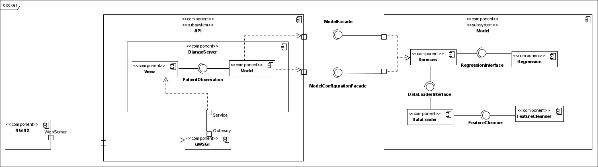

# آزمایش ششم: استفاده از Docker
## شرح آزمایش
در این آزمایش قصد داریم نحوه کار با
Docker
به عنوان یک ابزار 
Orchestration
و
Deployment
را بیاموزیم. به این منظور یک نیازمندی تعریف کرده، و برای آن یک سیستم نرم‌افزاری میکروسرویس ایجاد می‌کنیم.

## تحلیل نیازمندی‌ها
درمانگاهی یک مدل یادگیری ماشین روی داده‌های دیابت بیماران درخواست کرده است.
قرار است همه روزه نتیجه آزمایش چندین بیمار در این سیستم ثبت شود و سیستم در طول زمان به یادگیری داده‌های بیماران ادامه دهد.\
همچنین لازم است سیستم قابلیت پیشبینی نتیجه آزمایش بیمار را داشته باشد تا پزشکان درمانگاه گاها پیش از آماده شدن نتیجه اصلی آزمایش، از پیش‌بینی مدل یادگیری ماشین استفاده کنند.\
تمام ارتباطات با این سیستم باید از طریق یک
RESTfull API
محقق شود و نیازی به طراحی و ایجاد یک کارخواهِ
Front-End
برای این سیستم نیست چرا که قرار است زیرسیستم
Front-End
برون سپاری شود. سیستم باید دارای یک load-balancer معقول باشد تا در زمان‌های پیک مراجعین، دسترسی پذیری دچار آسیب نشود.
## طراحی سیستم نرم‌افزاری
به منظور ایجاد معماری سیستم از یک نگاه بالا به پایین
(Top-Down)
استفاده می‌کنیم. به این منظور ابتدا یک نمودار استقرار طراحی می‌کنیم سپس ذیل گره‌های نمودار استقرار، نمودار مولفه سیستم را طراحی خواهیم کرد.\
### نمودار استقرار
ابتدا یک گره به منظور فراهم آوردن
RESTfull API
خواسته شده قرار می‌دهیم. این گره را پشتِ
NGINX
که یک
Load-balancing WebServer
قرار می‌دهیم.
همچنین به منظور آنکه داده‌های بیماران به صورت مانا
(Persistent)
حفظ شود، گره‌ی
API
را در ارتباط با یک دیتابیس
PostgreSQL
قرار می‌دهیم.

همانطور که قابل مشاهده است از گره‌ی
API
دو نسخه به صورت همزمان مستقر شده است و تقسیم‌کننده‌ی بارِ
NGINX
با سیاست 
least_conn
بار را بین این دو نسخه تقسیم می‌کند (طبق این سیاست، هر درخواست از کارگزار، به نسخه‌ای داده می‌شود که در لحظه در حال خدمت‌رسانی به تعداد کمتری درخواست باشد). همچنین این گره‌ی
API
با استفاده از چارچوب
Django
پیاده‌سازی شده است.\
پس از آن، یک مدل یادگیری ماشین رگرسیون خطی نیاز است که داده‌های بیماران را رفته رفته یاد گرفته و برای پیش‌بینی دیابت نیز استفاده شود.

این مدل با پایتون ایجاد شده است و نحوه خدمت گرفتن از آن از طریق یک واسطِ پیامِ
RabbitMQ
محقق می‌شود. به این شکل گره‌ی
API
با کمترین اتصالات
(Coupling)
با مدلِ یادگیری ماشین ارتباط خواهد گرفت.

**در ادامه تصویر کلیِ نمودار استقرار را مشاهده خواهید کرد.**

دو مولفه‌ی زیرسیستم
(Subsystem، به معنی بالا-رده ترین مولفه‌ی نرم‌افزاری که روی گره‌ی استقرار می‌شیند. شایان توجه است که به دلیل ساختار تو در تو داشتن نمودار مولفه، چنین تعریفی کاربردی است.)
که در نمودار استقرار قابل مشاهده‌اند، زیرسیستم
API
و
Model
می‌باشند که آن‌ها را در **نمودار مولفه** بررسی می‌کنیم.
### نمودار مولفه

در ادامه نمودار‌ مولفه ایجاد شده ذکر می‌شوند که درک تدقیق شده‌ای از پیاده‌سازی سیستم نرم‌افزاری به ما می‌دهد.

مولفه‌ی مدل از زیرمولفه‌های زیر تشکیل شده است.
- Regression: مدل رگرسیون که به منظور یادگیری داده‌های دیابت استفاده خواهد شد.
- DataLoader: مولفه بارگذاری داده روی مدل‌های یادگیری ماشین.
- FeatureCleanser: مولفه پاکسازی و تنظیم فیچرهای یادگیری ماشین.
- Services: مولفه‌ای که مولفه‌های دیگر را کنار هم می‌گذارد و خدمات مورد نیاز برای یادگیری و پیش‌بینی بیماران دیابتی را فراهم می‌آورد.

این مولفه دو واسط برای خدمات گیری به نام
ModelFacade
و
ModelConfigurationFacade
ارائه می‌دهد. نمای اول به منظور درخواستِ یادگیری و پیش‌بینی مدل استفاده می‌شود و نمای دوم به منظور تنظیم
Hyperparameter
های مدل استفاده خواهد شد.\
این نما
(facade)
ها با استفاده از پکیج
[nameko](https://www.nameko.io/)
ایجاد شده‌اند و استفاده از متد‌های آن‌ها در واقع با روش
RPC (Remote procedure call)
و از طریق واسطِ پیامِ
RabbitMQ
ممکن خواهد بود.

در ادامه مولفه‌ی
API
را خواهیم داشت که ذیل خود یک مولفه
DjangoServer
و یک مولفه‌ی
uWSGI
خواهد داشت.
مولفه‌ی
uWSGI
به عنوان
Gateway
پایتونی ما عمل خواهد کرد و درخواست‌ها و پاسخ‌های سرور را به سمت مولفه‌ی بیرونیِ
NGINX
رد می‌کند.\
همچنین مولفه‌ی
API
از طریق زیر مولفه‌ی
Model
درون خود، از واسط‌های زیرسیستم
Model (شامل مدل یادگیری ماشین)،
که این واسط‌ها همان
ModelFacade
و
ModelConfigurationFacade
هستند استفاده می‌کند.

**در ادامه تصویر کلیِ نمودار مولفه را مشاهده خواهید کرد.**

## اجرای سیستم
